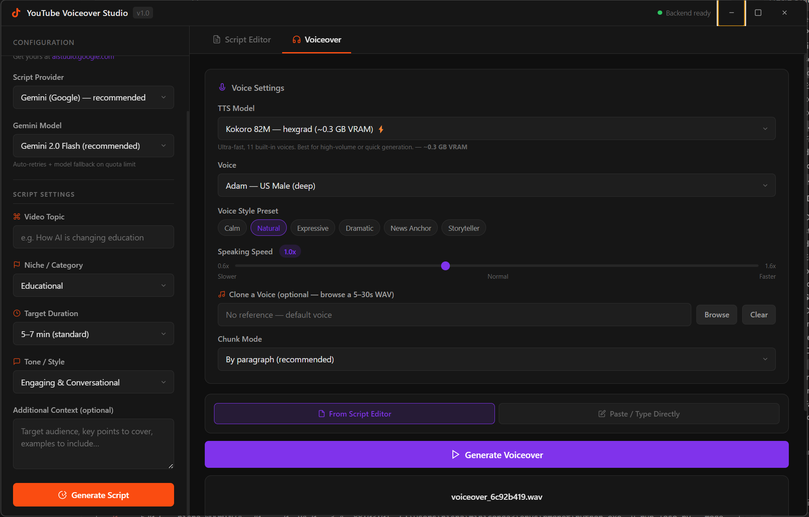

# 🎙️ YouTube Voiceover Studio

YouTube Voiceover Studio is a premium desktop application that combines AI-driven script writing with local and cloud-based text-to-speech (TTS) engines to streamline content creation. Built with **Electron** and a **Python/Flask backend**, it enables creators to draft engaging scripts and synthesize high-fidelity voiceovers in one integrated environment.



---

## ✨ Features

- **🤖 Multi-Model Script Generator**: Write engaging, structured scripts tailored to your niche, duration, and tone. Supports:
  - Google Gemini (via `google-genai` SDK)
  - Local LLMs (via Ollama or LM Studio)
  - Cloud API models (such as Qwen on DashScope)
- **🗣️ Advanced TTS Engine**: Convert scripts to studio-quality narration.
  - **Chatterbox TTS** (Resemble AI): High expressiveness with emotion and exaggeration controls.
  - **Kokoro 82M**: Ultra-fast synthesis with 11 built-in natural voices.
  - **XTTS v2** (Coqui AI): Studio-quality voice cloning using a 5-30s reference audio file.
  - **Gemini TTS**: Native cloud synthesis directly from Google Gemini's audio API (no local GPU required).
- **🚀 GPU-Accelerated Support**: Fully compatible with CUDA for rapid voice generation. Fallback to CPU is handled automatically.
- **📁 Automated Output Management**: Scripts and generated audio files (`.wav`) are systematically versioned and stored in the `output/` folder.

---

## 🛠️ Tech Stack

- **Frontend**: Electron, HTML5, JavaScript, and vanilla CSS (Glassmorphic dark mode).
- **Backend**: Python 3.10+, Flask, Flask-CORS.
- **AI/ML libraries**: PyTorch, Torchaudio, Google GenAI, Chatterbox-TTS, Kokoro, TTS (Coqui).

---

## 📋 Prerequisites

Before setting up the project, make sure you have the following installed:

1. **Node.js** (v18.0 or higher) -> [Download Node.js](https://nodejs.org)
2. **Python** (v3.10 or higher) -> [Download Python](https://python.org)
3. **NVIDIA CUDA Toolkit** (Optional, but highly recommended for fast local voice generation on NVIDIA GPUs).

---

## 🚀 Getting Started

### 1. Configure Secrets & Models

Create a `.env` file in the `backend/` directory to configure environment variables.

```ini
# backend/.env
HF_TOKEN=your_huggingface_write_token  # Required to download Chatterbox and XTTS models
HF_HUB_DISABLE_SYMLINKS_WARNING=1
```

> [!NOTE]  
> If using Google Gemini cloud services, you can configure your Gemini API Key directly within the app interface during runtime.

### 2. Run the Setup script

Double-click `setup.bat` or run it from your terminal:

```bash
# Run the setup script
.\setup.bat
```

This script will:

- Check for Node.js and Python installations.
- Install the required Python packages (including `torch` and PyTorch libraries).
- Install Electron and front-end dependencies via `npm`.
- Initialize the `output/` directory for saving generated assets.

### 3. Launch the Application

Double-click `start.bat` or run:

```bash
# Start the studio
.\start.bat
```

This script will set the appropriate environment flags and start the Electron frontend and Python backend server concurrently.

---

## 📂 Project Structure

```
youtube-voiceover-studio/
├── assets/                  # Images and graphics for documentation
├── backend/                 # Python/Flask microservice
│   ├── .env                 # API keys and environment configuration
│   ├── download_model.py    # Pre-downloads model weights
│   ├── requirements.txt     # Python backend dependencies
│   ├── script_gen.py        # Script generation interface (Gemini / Ollama / Qwen)
│   ├── server.py            # Flask API endpoints and job queue
│   ├── tts_engine.py        # Synthesis engine logic
│   └── tts_models.py        # Model registry and wrappers (Chatterbox, Kokoro, XTTS)
├── output/                  # Location of generated scripts & audio WAV files (Git-ignored)
├── src/                     # Electron frontend
│   ├── index.html           # Main dashboard layout
│   ├── renderer.js          # UI actions & API bindings
│   └── styles.css           # Premium Dark/Glassmorphic styling
├── main.js                  # Electron main process entry point
├── preload.js               # IPC bridge between frontend and main process
├── package.json             # NPM package scripts & configuration
├── setup.bat                # Windows environment setup script
└── start.bat                # App start script
```

---

## 🔧 Troubleshooting

### Local model downloads take too long or fail

- Make sure you have specified a valid Hugging Face write token (`HF_TOKEN`) in `backend/.env`.
- Ensure your internet connection is stable. The local TTS models (XTTS and Chatterbox) range between 1GB to 6GB and are cached under `~/.cache/huggingface/` on first download.

### Out of Memory (OOM) Errors / Slow generation

- If you do not have an NVIDIA GPU with at least 6GB of VRAM, Chatterbox TTS and XTTS v2 might run slowly on CPU.
- **Tip**: Switch to **Kokoro 82M** (ultra-lightweight, requires ~0.3 GB VRAM) or **Gemini TTS** (cloud-based synthesis) for instantaneous generation without local hardware bottlenecks.

---

---

## 📦 Building a Standalone `.exe` Installer

This app bundles an Electron frontend **and** a Python/Flask backend. Both must be compiled separately before packaging.

> **Prerequisites:** Python, Node.js, and `pip` must be on your PATH.

### Step 1 — Compile the Python backend

Double-click `build_backend.bat` or run it from a terminal:

```bat
build_backend.bat
```

This uses **PyInstaller** to compile `backend/server.py` and all its dependencies (PyTorch, Flask, TTS models, etc.) into a single executable:

```
dist_backend/backend_server.exe
```

> ⏱ First-time build takes **10–20 minutes**. Subsequent builds are faster.  
> 📦 Output size will be **4–8 GB** due to PyTorch being embedded.

### Step 2 — Package the Electron frontend

Once `dist_backend/backend_server.exe` exists, run:

```bat
npm run build:win
```

electron-builder will:
- Bundle the Electron app
- Copy `backend_server.exe` into the installer as a bundled resource
- Generate a Windows NSIS installer at:

```
dist/YouTube Voiceover Studio Setup x.x.x.exe
```

### What the installed app does

When a user launches the installed app, Electron automatically starts `backend_server.exe` in the background (no Python install required on their machine). When the app closes, the backend process is terminated automatically.

---

## 📄 License

This project is open-source and licensed under the MIT License.
